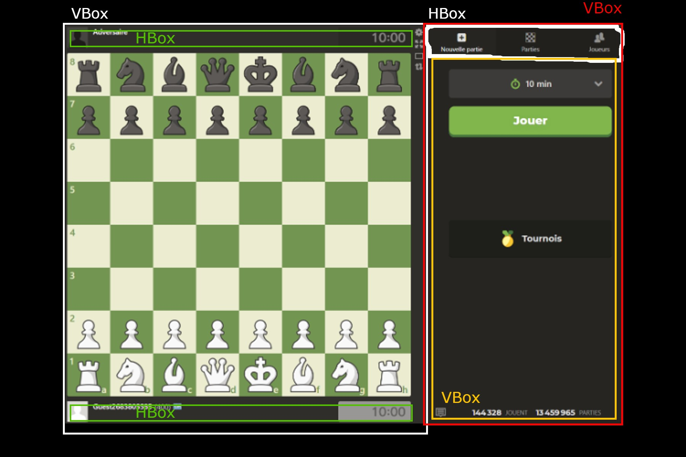

# Projet d'Échecs en Java avec JavaFX
<span style="color: #26B260">ANDREU Sarah, DAUBREGE Simon, EGEA Allan, RIBBE Jules

## Introduction

Ce dossier présente une analyse détaillée du projet d'échecs développé en Java avec une interface utilisateur en JavaFX. Nous allons explorer le modèle MVC, les bonnes pratiques en ergonomie, l'architecture du projet, et les fonctionnalités implémentés pour répondre aux besoins du client.

## 1. Modèle MVC et Bonnes Pratiques en Ergonomie

### Modèle

#### Architecture du Projet

Le projet suit le modèle MVC (Modèle-Vue-Contrôleur) pour séparer les différentes responsabilités de l'application. Cela facilite la maintenance, l'évolution et les tests de l'application.

- **Modèle (Model)** : Représente les données de l'application et la logique métier.
- **Vue (View)** : Représente l'interface utilisateur.
- **Contrôleur (Controller)** : Gère les interactions de l'utilisateur et met à jour la vue en fonction du modèle.

#### Système de Génération du Plateau dans `ChessPlate.java`

La classe `ChessPlate` est responsable de l'initialisation et de la gestion du plateau de jeu. Elle contient une matrice de pièces représentant le plateau et fournit des méthodes pour déplacer les pièces et vérifier les mouvements valides.

#### Les différents champs de la classe `ChessPlate` :
```java
 private int tour;  // Indique quel joueur doit jouer (0 pour les blancs, 1 pour les noirs)
private final VBox board;  // Représente l'échiquier graphique
private Piece[][] posPiece;  // Matrice contenant les pièces à leurs positions respectives
public Piece selectedPiece;  // Référence à la pièce actuellement sélectionnée
private boolean gameOver = false;  // Indique si la partie est terminée
private ChessController controller;  // Référence au contrôleur pour interagir avec la vue
```

#### Création du Plateau de Jeu dans le Constructeur de `ChessPlate`
```java
public ChessPlate(ChessController controller) {
    this.controller = controller;
    board = new VBox();
    tour = 0;
    createBoard();
    placePieces();
}
```

#### Création du Plateau d'Échecs dans l'interface graphique dans `ChessPlate`
```java
private void createBoard() {
    for (int i = 0; i < 8; i++) {
        HBox row = new HBox();
        for (int j = 0; j < 8; j++) {
            StackPane square = new StackPane();
            square.setMinHeight(80);
            square.setMinWidth(80);
            if ((i + j) % 2 == 0) {
                square.setStyle("-fx-background-color: #EEEED5");
            } else {
                square.setStyle("-fx-background-color: #7D945D");
            }
            row.getChildren().add(square);
        }
        board.getChildren().add(row);
    }
}
```

#### Utilisation du Principe d'Héritage en Java pour les Pièces

Le système de pièces utilise le principe d'héritage en Java. La classe `Piece` est la classe de base, et chaque type de pièce (roi, reine, tour, fou, cavalier, pion) hérite de cette classe. Chaque sous-classe implémente les mouvements spécifiques à son type.

```java
public abstract class Piece {
    protected Position position;
    protected Color color;

    public Piece(Position position, Color color) {
        this.position = position;
        this.color = color;
    }

    public abstract boolean isValidMove(Position newPosition, Piece[][] board);

    public void move(Position newPosition) {
        this.position = newPosition;
    }

    // Getters et setters
}

public class King extends Piece {
    public King(Position position, Color color) {
        super(position, color);
    }

    @Override
    public boolean isValidMove(Position newPosition, Piece[][] board) {
        int dx = Math.abs(newPosition.getX() - position.getX());
        int dy = Math.abs(newPosition.getY() - position.getY());
        return (dx <= 1 && dy <= 1);
    }
}

// Implémentation similaire pour les autres pièces (Queen, Rook, Bishop, Knight, Pawn)
```

### Vue

Pour la partie vue, nous avons essayé au maximum de produire une interface similaire à celle de Chess.com. L'interface utilisateur est conçue avec JavaFX, en utilisant des fichiers FXML pour définir la structure de l'interface et des classes Java pour gérer les interactions.

```xml
<!-- Exemple de fichier FXML pour l'interface utilisateur -->
<GridPane fx:id="chessBoard" xmlns:fx="http://javafx.com/fxml" fx:controller="com.example.ChessController">
    <!-- Définition des lignes et colonnes du plateau d'échecs -->
    <children>
        <Label fx:id="timerWhite" text="Temps Blancs: 15:00" GridPane.rowIndex="0" GridPane.columnIndex="0"/>
        <Label fx:id="timerBlack" text="Temps Noirs: 15:00" GridPane.rowIndex="1" GridPane.columnIndex="0"/>
        <!-- Cases du plateau d'échecs -->
        <Pane fx:id="square00" GridPane.rowIndex="2" GridPane.columnIndex="0" style="-fx-background-color: white;"/>
        <Pane fx:id="square01" GridPane.rowIndex="2" GridPane.columnIndex="1" style="-fx-background-color: gray;"/>
        <!-- Ajout des autres cases -->
    </children>
</GridPane>
```

### Contrôleur et Ergonomie

Pour le principe du contrôleur et de l'ergonomie, nous avons décidé d'utiliser un système basé sur des clics pour déplacer les pièces sur l'échiquier. La pièce sélectionnée est affichée à l'écran par une petite case qui change de couleur selon la pièce sélectionnée sur le plateau. Les déplacements possibles de cette pièce sont indiqués par une autre couleur.

#### Gestion des Clics dans `ChessPlate.java` avec la methode `handleClick`

## 2. Les différents problèmes rencontrés

Au cours de ce projet, nous avons rencontré divers problèmes, notamment au niveau des coordonnées. Lorsque nous essayions de déplacer une pièce sur l'échiquier, elle n'atteignait pas les coordonnées prévues. Cela provenait du fait que nous utilisions les indices i et j pour notre matrice de déplacement, tandis que dans les classes de chaque pièce, nous utilisions les coordonnées x et y. Ces deux systèmes de coordonnées n'ayant pas la même logique, il a donc fallu corriger cela pour permettre le déplacement correct des pièces.

Par la suite, nous avons rencontré un problème concernant le déplacement des pions. Selon leur couleur, les pions se déplacent soit en +1 soit en -1, c'est-à-dire qu'ils montent ou descendent sur l'échiquier. Pour corriger ce problème, nous avons modifié la méthode de détection de la couleur d'une pièce lorsqu'elle est sélectionnée, afin de garantir que les pions se déplacent dans la direction correcte.


## 3. Diagrammes d'Analyse et de Conception

### Diagramme de Classe

Le diagramme de classe montre la structure des classes et leurs relations.


## 4. Maquettes Graphiques Réalisées (Wireframes ou Mockups)



## 5. Politique de Tests

### Manque de Temps

Par manque de temps, nous n'avons pas réussi à réaliser les tests unitaires. Cependant, nous comprenons l'importance des tests et prévoyons de les implémenter dans une version future du projet.

## 6. Fonctionnalités Implémentées pour Répondre au Besoin Client

Pour répondre aux besoins des clients, nous avons implémenté un jeu d'échecs classique où les blancs commencent. Ensuite, les joueurs alternent leur tour. C'est un jeu qui se joue en joueur contre joueur. La partie se termine lorsque l'un des deux rois est capturé. L'interface est simple, compréhensible et intuitive, permettant à n'importe quel joueur de comprendre rapidement et de prendre plaisir à jouer.

### Fonctionnalités Implémentées

- **Gestion du Plateau de Jeu** : Initialisation et affichage du plateau d'échecs avec toutes les pièces.
- **Mouvements des Pièces** : Validation et exécution des mouvements des pièces selon les règles des échecs.
- **Interface Utilisateur** : Interface graphique intuitive et réactive, inspirée de Chess.com.
- **Système de Sélection** : Sélection des pièces et des cases de destination par clics, avec des indications visuelles des mouvements possibles.

### Conclusion

Ce rapport présente une vue détaillée du projet d'échecs en Java avec JavaFX, couvrant l'architecture MVC, les bonnes pratiques en ergonomie, et les fonctionnalités principales du jeu. Nous avons mis l'accent sur une interface utilisateur simple et intuitive, tout en respectant les règles classiques des échecs.

---
L’organisation de l’équipe, la répartition des tâches entre les membres et le pourcentage du projet réalisé par chacun :

Simon s’est principalement occupé de l’interface graphique, donc l’implémentation de tous les fichiers fxml et de la class du Controller correspondant.
Allan a participé à l'implémentation du fxml principale mais aussi de l’implémentation de la Class Chrono, bien que non fonctionnelle dû au différents problèmes rencontrés pour le déplacement des pièces sur l'echequier, elle est tout de même codée. Il s’est aussi occupé du diapo et du rapport à l’aide de Sarah.
Sarah qui a donc participé à une bonne partie du rapport et du diapo.
Et Jules qui a implémenté les Class ChessApp, ChessPlate, Piece, Bishop, King, Knight, Pawn, Queen, et Rook. Il a aussi participé à la redaction du rapport.

La répartition des points selon Simon : Sarah : 10%, Allan : 25%, Simon 30%, Jules 35%.

La répartition des points selon Sarah : Sarah : 10%, Allan : 25%, Simon 30%, Jules 35%.

La répartition des points selon Allan: Sarah : 10%, Allan : 25%, Simon 30%, Jules 35%.
pour ma part, le travaille qui implique le java correspond à 40% du projet si il est parfaitement réalisé. Cependant, il nous manque pas mal de fonctions comme la condition d'échec et mat et l'enregistrememnt des parties.
Je pense donc donner à Jules 35%. Simon Sarah et moi nous sommes répartis la fxml ainsi que le diaporama et le rapport. chaque pourcentage ci-dessus represente le taux de travaille de chacun des membres du groupe.

La répartition des points selon Jules: Ayant réalisé le coeur du projet ce qui représente toutes les classes java et methodes permettant de faire fonctionner un jeu d'echec j'estime ma part à 50% et je laisse 50% pour les autres membres de l'équipe à se départager selon ce qu'ils estiment avoir fait. Le jeu n'est pas complet mais il est fonctionnel et il est possible de jouer une partie d'échec. Ayant réalisé seul la partie la plus complexe du projet, le fait que j'ai du reprendre le travail de mes camarades pour le rendre présentable, me pousse à donner une part plus importante à ma contribution ce que je trouve légitime.